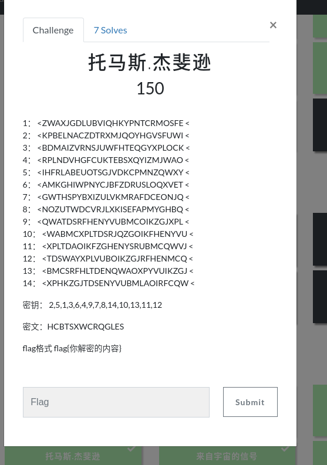
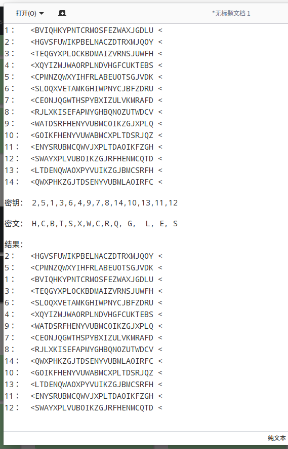
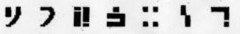
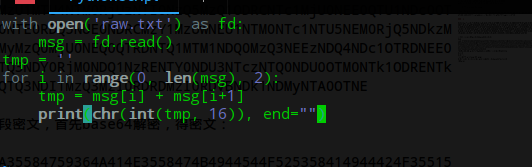
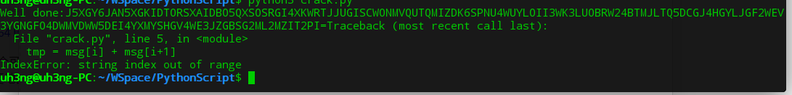
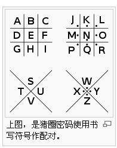
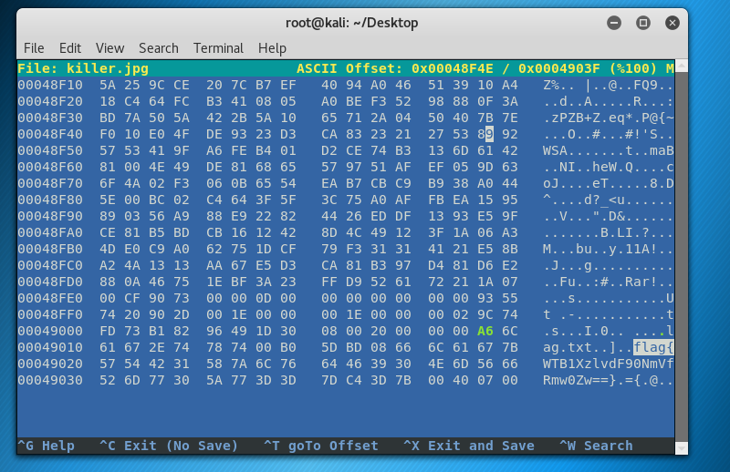

# QCTF writeup

## Crypto

### 吃火锅啦~

冬至吃饺子，过年过火锅咯~~

aababababbaaaaaaabbabaabbaa

bbbabaaabaabaabaaaba
abaaaaabaaaaaaaabaabbbaabbab

flag格式：flag{xxxx}

很显然的[培根密码](https://baike.baidu.com/item/%E5%9F%B9%E6%A0%B9%E5%AF%86%E7%A0%81/2134182?fr=aladdin)，五五分组，每个组可以表示一个字符。可以自己写脚本，或者用CTFcryptoCrack工具解密。

### 滴答滴答滴答滴。。。
..-./.-../.-/--./----.--/--/---/.-./....././..--.-/-.-./-----/-.././..--.-/../...../..--.-/..-./..-/....-/-----.-

flag格式：均小写，有下划线，flag{xxxx}

莫尔斯电码，曾经还用它写过纸条，把密文复制下来到[在线解密网站](http://www.atool.org/morse.php)解密即可。解密之后有个%u7b 和 %u7d的东西，不要慌，那个代表一对大括号。

### 喜洋洋~

fy3}l0tau_g_1{gt

flag格式：flag{xxxx}

[栅栏密码](https://baike.baidu.com/item/%E6%A0%85%E6%A0%8F%E5%AF%86%E7%A0%81/228209?fr=aladdin)，同理用CTFcryptoCrack可解，或者自己用记事本手动解密，根据flag格式很容易找出明文。

### 这是什么东东？
7c4f29407893c3m34a6cb7a87bf045c0d
看上去应该是md5，但是仔细观察发现多了一位，应该是32位才对，有个字母乱入了，把m删掉就行，毕竟十六进制最多就到f，附上[解密网站](http://www.cmd5.com/)

### .!?
..... ..... ..... ..... !?!!. ?.... ..... ..... ..... .?.?! .?... .!...
..... ..... !.?.. ..... !?!!. ?!!!! !!?.? !.?!! !!!.. ..... ..... .!.?.
..... ...!? !!.?. ..... ..?.? !.?.. ..... .!.?. ..... ..... !?!!. ?!!!!
!!!!! !?.?! .?!.? ..... ....! ?!!.? ..... ...?. ?!.?. ..... !.?.. .....
!?!!. ?!!!! !!?.? !.?!! !!!!! !!!!. ..... ...!. ?.... ...!? !!.?. .....
?.?!. ?..!. ?.... ..... !?!!. ?!!!! !!!!? .?!.? !!!!! !!!!! !!!.? .....
..!?! !.?.. ....? .?!.? ....! .!!!. !!!!! !!!!! !!!!! !!.?. ..... .!?!!
.?... ...?. ?!.?. ..... !.!!! !!!!! !.?.. ..... ..!?! !.?.. ..... .?.?!
.?... ..... !.?.

一种编码[Brainfuck/Ook](https://www.splitbrain.org/services/ook)，用提供的网站解密即可。另外推荐一篇博客[CTF密码学（Crypto）一些在线解密网站](https://blog.csdn.net/qq_39091609/article/details/78627776)

### 托马斯.杰斐逊

密钥里面的数字对应题目中的行号，密文里的字母表示对应密钥那一行的开头字母，每一行都包含了26个全部英文字母。比如第一个密钥和密文，选取第二行从H开始，把H以后的序列（包含H）剪切到该行的开头，变成**HGVSFUWI**KPBELNACZDTRXMJQOY(**加粗部分是剪切过来的**)这样就相当于把每行当成一个转盘，首尾循环。然后按照密钥行号的顺序排列每次得出的序列，得到解密后的情况如图中结果部分

尝试读取每一列的字母，发现只有倒数第二十一列里的字母连起来有意义，flag为×××××××××admin,注意大小写。

### 来自宇宙的信号

银河战队出击

flag格式 flag{字母小写}

一开始以为是盲文，结果看了几个盲文表后没有对上的，除了图片外唯一的提示就是那个“银河战队出击”，网上搜一下也都是没有价值的东西，百度识图也没有结果，忍不住把题目一放就搜到了writeup

之后我认识到了一个新东西[标准银河字母](https://baike.baidu.com/item/%E6%A0%87%E5%87%86%E9%93%B6%E6%B2%B3%E5%AD%97%E6%AF%8D/2691355?fr=aladdin),真是长见识。把字母表拿来一对比，写出flag，这题就这么过吧。

### 猪圈
**密文太长，为了显示方便，我在写的时候中间有换行符**

R29kIGpvYjo1NzY1NkM2QzIwNjQ2RjZFNjUzQTRBMzU1ODQ3NTkzNjRBNDE0RTM1NTg0NzRCNDk0NDU
0NEY1MjUzNTg0MTQ5NDQ0MjRGMzU1MTU4NTM0RjUzNTI0NzQ5MzQ1ODRCNTc1MjU0NEE0QTU1NDc0OT
UzNDM1NzRGNEU0RDU2NTE1NTU0NTE0RDQ5NUE0NDRCMzY1MzUwNEU1NTM0NTc1NTU5NEM0RjQ5NDkzM
zU3NEIzMzRDNTU0RjQyNTI1NzMyMzQ0MjU0NEQ0QTRDNTQ1MTM1NDQ0MzQ3NEEzNDQ4NDc1OTRDNEE0
NzQ2MzI1NzQ1NTYzMzU5NDc0RTQ3NDY0RjM0NDQ1NzRENTY0NDU3NTczNTQ0NDU0OTM0NTk1ODRENTk
1MzQ4NDc1NjM0NTc0NTMzNEE1QTQ3NDI1MzQ3MzI0RDRDMzI0RDVBNDk1NDMyNTA0OTNE

这题需要用到很多密码，就给出一段密文，首先base64解密，得密文：
God job:57656C6C20646F6E653A4A35584759364A414E3558474B4944544F525358414944424F35515
8534F5352474934584B5752544A4A5547495343574F4E4D56515554514D495A444B3653504E5534
5755594C4F494933574B334C554F425257323442544D4A4C5451354443474A344847594C4A47463
25745563359474E47464F3444574D56445757354445493459584D5953484756345745334A5A4742
5347324D4C324D5A49543250493D
然后把冒号之后的密文放到一个文件里，写脚本两两分组，每个分组含两个十六进制字符，尝试用ASCII码解密每个组

解密结果是：

报错是因为文件末尾有个迷之空白字符，不影响做题，我们只需要关注那段base32代码（等号之前的字符串）就好，到网站解密base32得到Only one step away:Q29uZ3JhdHVsYXRpb25zOm9janB7emtpcmp3bW8tb2xsai1ubWx3LWpveGktdG1vbG5ybm90dm1zfQ==

然后继续base64得到：
Congratulations:ocjp{zkirjwmo-ollj-nmlw-joxi-tmolnrnotvms}
emmm....还差最后一步，这一步需要联系题目“猪圈”，找到这么一张图表

然后以ocjp肯定对应flag为突破口，得知只要把左右两张表对应位置上的字母调换就可得出最终的flag。

## Misc

### 签到题

加群，找公告，过～

### killer is coming

下载图片后用hexeditor打开或者记事本打开，搜索flag

### killer2 is coming

与上题解法类似，不说了，过

### 来自13区的祝福

rot13加密，再加密一次可以得到原文,[解密网站](http://www.mxcz.net/tools/rot13.aspx)

### 好多字符哦~

只关注每组末尾的两位十六进制数，转成字符就得到flag。

### Oh no!!!!There are so much killers!!！

binwalk

**(有事暂时离开，待更。。。)**