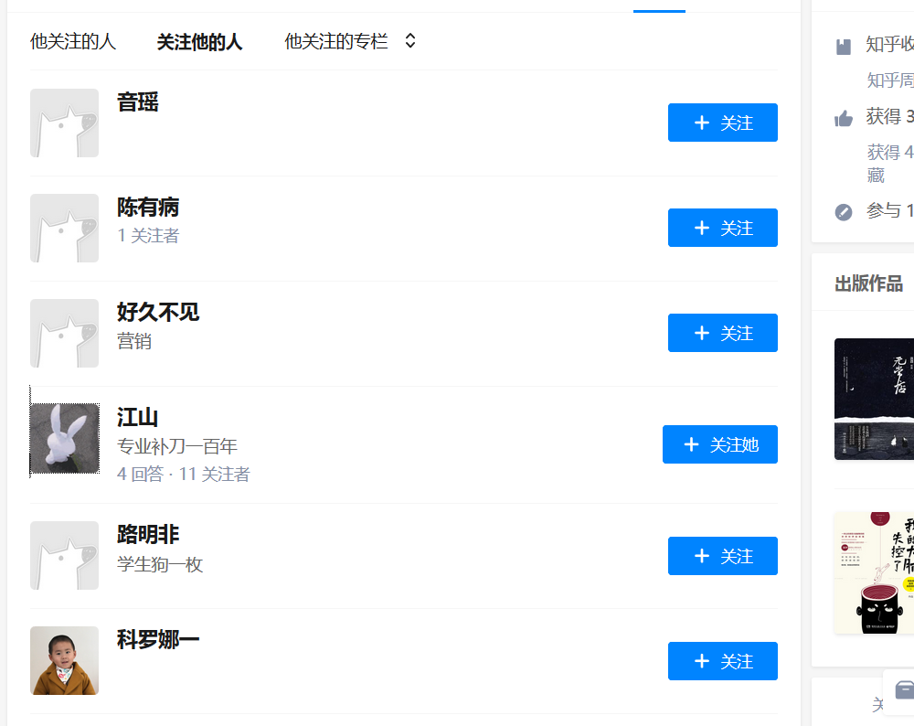
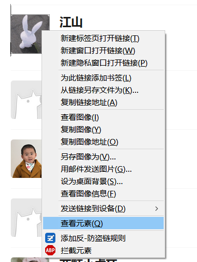

## 操作环境
Python2或者Python3
第三方库：requests

## 开始
知乎是个练习爬虫的好地方，可以找到很多资源，还能挑战一下反爬虫机制。刚开始不懂得AJAX的时候真的拿这些动态加载的网页没有办法，只好退一步，用selenium+chromedriver写一些简单的程序，这样做虽然简化了开发过程，但是总是觉得效率很低，而且方式不太优雅，只是调用浏览器去做着做那，遇到异常还不好处理。

所以我决定放弃以前用selenium写的爬取头像的程序，重新分析网页的请求，直接找到每个用户头像的url下载下来。

## 找到头像的URL
首先希望你用的是火狐或者是谷歌浏览器，并且会使用F12的开发者工具，我们先随意找一个关注着很多的用户，然后点开他的关注者页面

随意找一个有头像的用户，右键审查元素

先认识一下知乎存储头像的url，我们的目标就是拿到类似于这样的链接

接下来以火狐浏览器为例，把从F12工具栏里查看抓取的请求，这里仅需要查看类型为XHR的请求即可，这种类型的请求往往就是通过异步请求获取的json数据

我们根据请求名称猜测，那个有followers的json数据就是我们要的东西，点开就能看到请求头，还有响应内容

其中data字段里面的0-19就是本页面中显示的20个关注者，展开可以看到每个关注者的信息

可以很明显的知道该用户的昵称、id和头像等信息，注意截图的第一行就是他头像的链接了，复制该链接，把后面那个"_{size}"去掉（即https://pic3.zhimg.com/v2-4748657d76e0c4235f29d6b45fba6208.jpg）就可以从浏览器上之间看到他的头像大图了，然后我们把这个过程用代码实现就可以了。

API:https://www.zhihu.com/api/v4/members/wen9/followers?include=data[*].answer_count,articles_count,gender,follower_count,is_followed,is_following,badge[?(type=best_answerer)].topics&offset=20&limit=20

以上是获取关注者的url，修改最后的offset的值可以实现翻页，如翻到第二页（offset=40）

## 从URL中下载头像
下面是构建请求的过程，直接用python发送get请求会被知乎拦截，然后尝试添加headers信息，还是不行，最后加上自己已经登录进去的cookie就可以了，cookie一样可以通过开发者工具获取

followers里面就是关注者的列表了，在结合前面的分析，从中提取出头像的链接，然后get这个链接，把图片下载下来，保存成图像文件。剩下的步骤就很简单，不再细说了

